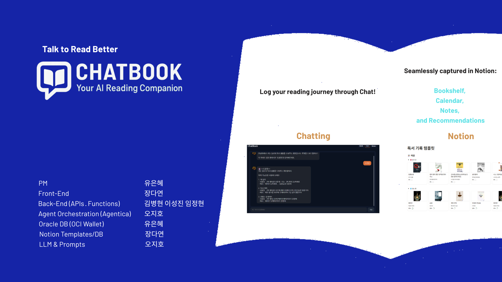
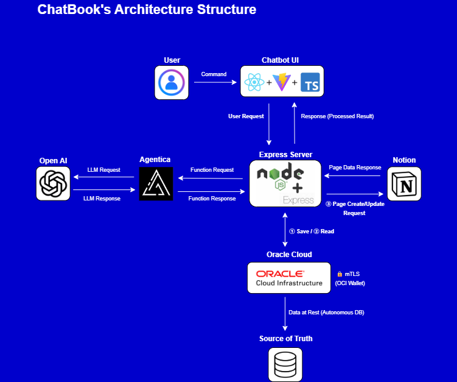
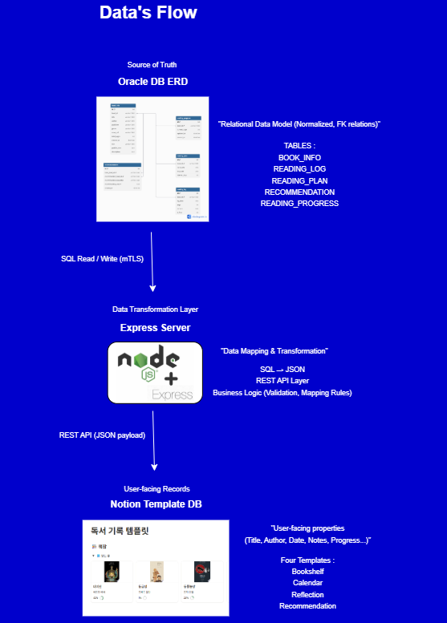

# 1. ChatBook: AI Reading Companion  

ChatBook is an AI-powered reading management system built on the **Agentica** framework.  
It is designed to revive the depth and consistency of reading habits that are fading in today’s digital era.  
As people become accustomed to quick searches and instant answers, their ability to read, comprehend, and reflect on longer texts is gradually diminishing.  

Through a conversational chatbot interface, ChatBook helps users build and sustain meaningful reading habits with ease.  


## 🎯 Motivation & Purpose  
ChatBook is more than just a logging tool — it aims to become an **“AI reading partner that turns books into a daily habit.”**  

- **Automated Reading Logs**  
  → Simple prompts like *“Register Capital”* or *“I read 50 pages today”* are instantly recorded without manual entry.  

- **Seamless Productivity Integration**  
  → All records are synced in real-time to **Notion templates**, where users can view their bookshelf, calendar, reflections, and book recommendations.  

- **Enhanced Learning Efficiency**  
  → From reading schedules → reflections → personalized recommendations, ChatBook provides a consistent and structured reading journey.  


## ✨ Core Values  

- **Conversation-driven UX**  
  Manage your entire reading process through natural chatbot dialogue, without tedious manual entry.  

- **Personalized Experience**  
  Get book suggestions powered by LLMs and tailored to your reflections and reading history.  

- **Automated Record-keeping**  
  Reduce the burden of manual tracking and focus on building sustainable reading habits.  


🚀 ChatBook is not just a record-keeping tool — it’s an AI companion that supports your entire reading life.


### 🎥 Demo
[](https://youtu.be/bSlSa404XV0?si)
👉 Click above to watch the demo video


# 2. Architecture Structure  

  


### 📌 Explanation  
- **User & Chatbot UI**: Frontend built with React + Vite + TypeScript, providing a lightweight, interactive chat interface.  
- **Agentica + OpenAI**: Natural language requests are processed through LLM for classification, summarization, and reasoning.  
- **Express Server**: Middleware that handles validation, mapping, and data transformation between systems.  
- **Oracle Cloud (Autonomous DB)**: The single source of truth, storing structured relational data with secure mTLS.  
- **Notion**: Final user-facing interface where logs, plans, reflections, and recommendations are recorded in a structured template.


# 3. Core Features  

### 📚 Automated Reading Logs  
- Natural chatbot commands like *“Register Capital”* or *“I read 30 pages today”*  
- Logs are stored in Oracle DB → synced to Notion **Bookshelf & Calendar**

### 🗓 Reading Plans  
- AI generates personalized **reading schedules** based on goals (e.g., finish in 7 days)  
- Synced to Notion Calendar for daily tracking  

### ✍️ Reflections  
- Users record mid-reading thoughts or reviews via chatbot  
- Stored as **Reflection entries** in Notion for later recall  

### 💡 Book Recommendations  
- LLM analyzes reading history + reflections  
- Provides **personalized recommendations**, stored in Notion Recommendation DB  

### 📊 Unified Dashboard (Notion Integration)  
- Four linked databases in Notion:  
  - **Bookshelf** → Registered books  
  - **Calendar** → Plans & progress  
  - **Reflection** → Reading notes  
  - **Recommendation** → AI-suggested titles  
- Keeps all reading data consistent and structured across platforms  


 # 4. Data Flow

The data flow of **ChatBook** ensures secure, structured, and automated synchronization between user input and the Notion interface.



### 🔹 Steps
1) **Oracle DB (Autonomous)**
   - **Source of Truth**: All relational data (normalized, FK relations)  
   - Tables: `BOOK_INFO`, `READING_LOG`, `READING_PLAN`, `RECOMMENDATION`, `READING_PROGRESS`  
   - Access secured via **mTLS** (mutual TLS)  

2) **Express Server (Data Transformation Layer)**
   - Maps and transforms **SQL ↔ JSON**  
   - Provides REST API endpoints for frontend and Agentica  
   - Handles validation, mapping rules, and business logic  

3) **Notion Template DB**
   - User-facing interface with **structured templates**  
   - Four key templates:  
     - 📚 **Bookshelf** (Book registration, metadata)  
     - 📅 **Calendar** (Reading plans, schedules)  
     - ✍️ **Reflection** (Reading notes, thoughts)  
     - 💡 **Recommendation** (AI-powered suggestions)  

👉 This flow guarantees:
- **Data integrity** between Oracle and Notion  
- **Real-time synchronization** of reading logs and reflections  
- **Scalability** with enterprise-level DB + lightweight Notion templates


# 5. Installation & Setup  

### 📌 Requirements  
- Node.js v18+  
- Oracle Instant Client + **OCI Wallet** (for Autonomous DB mTLS connection)  
- Notion account with API integration enabled  
- Cloudinary account (for media uploads)  
- Google Books API Key (for book search and metadata)  

### 📌 Environment Variables (.env)  
Create a `.env` file in the root directory and fill in the following values:  

```bash
# Server
PORT=3001

# LLM 
OPENAI_API_KEY=

# Notion integration
NOTION_TOKEN=
NOTION_DATABASE_ID=
NOTION_READDATABASE_ID=
RECOMMENDED_BOOK_DB_ID=
NOTION_CALENDAR_DB_ID=
NOTION_REVIEW_DB_ID=

# Google Books API
GOOGLE_BOOKS_API_KEY=

# Cloudinary (media upload)
CLOUDINARY_CLOUD_NAME=
CLOUDINARY_UPLOAD_PRESET=
CLOUDINARY_API_KEY=
CLOUDINARY_API_SECRET=

# Oracle Autonomous DB (mTLS)
ORACLE_USER=
ORACLE_PW=
ORACLE_CONNECT=          # e.g. db2025_high
ORACLE_WALLET_PATH=      # path to OCI Wallet
ORACLE_CLIENT_PATH=      # path to Instant Client
TNS_ADMIN=               # path containing sqlnet.ora, tnsnames.ora
````

# 6. How to Run  

### 📌 Backend  
```bash
cd backend
npm install
# ts-node must be enabled via tsconfig.json
npm run dev
````
👉 Starts the Express server at http://localhost:3001

### 📌 Frontend
```bash
cd frontend
npm install vite
npm run dev
````

👉 Starts the Vite dev server at http://localhost:5173

# 7. Project Structure  

```bash
webweb/
 ┣ backend/          # Express server, DB handlers (REST API, validation, Oracle integration)
 ┣ core/             # Agentica functions, LLM orchestration (summarization, recommendations, etc.)
 ┣ frontend/         # React + Vite + TypeScript chatbot UI
 ┣ oracle_wallet/    # OCI Wallet files for Autonomous DB (mTLS certificates & configs)
 ┣ types/            # TypeScript type definitions for shared models
 ┣ docs/images/      # Architecture & Data Flow diagrams
 ┣ agentica.config.js # Agentica framework configuration
 ┣ tsconfig.json     # TypeScript configuration
 ┣ package.json      # Project dependencies
 ┗ README.md
````

# 8. Oracle Cloud Security Highlights  

### ☁️ Oracle Autonomous DB Integration  
- All application data is stored in **Oracle Autonomous Database (ATP)**.  
- Acts as the **single source of truth** with relational integrity (PK/FK enforced).  
- Provides **auto-scaling, backup, and patching** directly on Oracle Cloud.  

### 🔒 mTLS with OCI Wallet  
- Every DB connection is secured via **mutual TLS (mTLS)**.  
- **OCI Wallet** files (`cwallet.sso`, `sqlnet.ora`, `tnsnames.ora`) are required for authentication.  
- Unauthorized clients cannot connect without the wallet + credentials.  
- Ensures **end-to-end encryption** between Express backend ↔ Oracle Cloud DB.  

### 🔑 Secure Credential Management  
- Wallet path and DB credentials are injected via `.env` variables.  
- No sensitive configs are committed thanks to `.gitignore`.  
- `TNS_ADMIN` environment variable ensures the Instant Client always references the wallet securely.  

### 🛡 Data Integrity & Reliability  
- Oracle Cloud provides **transaction-level consistency** and **high availability**.  
- Reading logs, book metadata, recommendations, and reflections are always synchronized with Notion.  
- Guarantees both **enterprise-grade security** and **seamless user experience**.  

👉 By combining **Oracle Autonomous DB + OCI Wallet (mTLS)**, ChatBook ensures a **cloud-native, secure, and scalable** reading management system.
